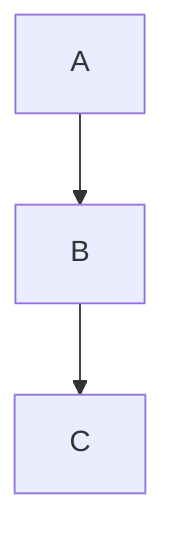
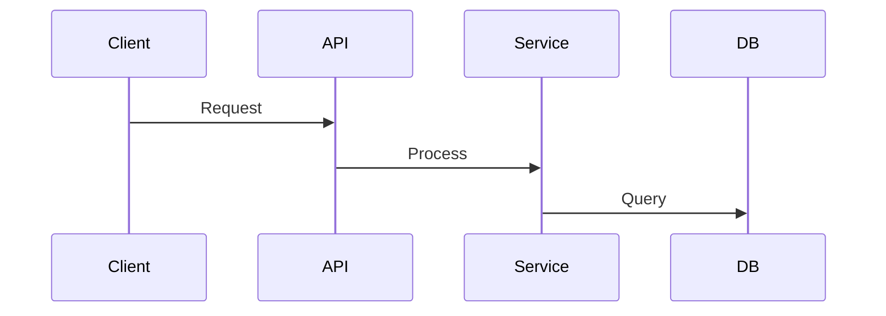

## Quick start

Launch a subagent to explore the target codebase, then write a comprehensive architecture document to `./docs/dev/architecture.md` (or a user-specified path). The document starts high-level for quick scanning and drills into detailed sections so thorough enough that re-exploring the codebase becomes unnecessary.

## Workflow

1. **Confirm scope** — Ask the user for the target workspace root (default: current workspace) and document output path (default: `./docs/dev/architecture.md`).

2. **Explore the codebase** — Load the `exploring-code` skill, then launch an `explore` subagent using its checklist. Append the following additional instructions to the standard exploration prompt:

```
Additionally, capture these details for documentation:
- Exact file paths for every module, service, component, and utility referenced
- Function signatures and key type definitions for public APIs
- Configuration file locations and their schemas
- Database schema details, migration strategies, and ORM usage
- API route definitions and request/response contracts
- Environment variables and their purposes
- Build, test, and deployment commands
- Any domain-specific business logic or rules
- Error handling conventions and error code definitions
```

3. **Receive the exploration report** — Collect the subagent's comprehensive output.

4. **Write the architecture document** — Create the output directory if needed (`mkdir -p`) and write the document using the template below. Populate every section with specific details from the exploration report. Use actual file paths, function names, and code references — not vague descriptions.

## Document template

````markdown
# Architecture

## Overview

[2-3 paragraph high-level summary. What does this project do? What problem does it solve? Who uses it? What technology stack does it use?]

## Technologies Used

| Technology | Purpose              | Notes                                          |
| ---------- | -------------------- | ---------------------------------------------- |
| [name]     | [what it's used for] | [version, why chosen, alternatives considered] |

## System Architecture

[Mermaid diagram showing high-level component relationships]



[Prose explanation of the architecture diagram, data flow, and key architectural decisions]

## Project Structure

```
[Directory tree of the project structure with brief annotations for each major directory]
```

## Modules

[One section per major module or service. Each section includes:]

### Module Name

- **Location:** `path/to/module/`
- **Purpose:** [What this module does]
- **Key files:**
  - `file.ts` — [brief description]
  - `file.ts` — [brief description]
- **Dependencies:** [what it depends on]
- **Public API:** [key functions, classes, exports with signatures]

## Data Models

[All domain models, database tables, schemas. Include field definitions, types, and relationships. Reference the files where they are defined.]

### Model Name

- **Defined in:** `path/to/model.ts`
- **Fields:**
  - `field: type` — [description]
- **Relationships:** [foreign keys, associations]

## Interfaces

[Document every external-facing interface the project exposes. Include web APIs, library public APIs, CLI commands, TUI elements, message queue consumers, event handlers, and any other user-facing surface. Omit subsections that don't apply to the project.]

### Web API

[HTTP endpoints, routes, and their contracts. Include methods, paths, request/response shapes, and authentication requirements.]

#### Endpoint Name

- **Route:** `METHOD /path`
- **Defined in:** `path/to/route.ts`
- **Request:** [shape or schema]
- **Response:** [shape or schema]
- **Auth:** [requirements]

### Library API

[Public functions, classes, and exports for library projects. Include signatures and descriptions.]

#### Function / Class Name

- **Defined in:** `path/to/module.ts`
- **Signature:** `fn(args): returnType`
- **Description:** [what it does]

### CLI Commands

[Command-line interface commands, flags, and usage.]

#### Command Name

- **Command:** `cli command [flags]`
- **Defined in:** `path/to/command.ts`
- **Description:** [what it does]
- **Flags:** [list of flags and their descriptions]

### TUI

[Terminal UI layout, components, and interactions if applicable.]

### Message Queue / Events

[Consumed or produced messages, event names, and payloads if applicable.]

## Configuration

[How the project is configured. Environment variables, config files, feature flags.]

### Environment Variables

| Variable | Required | Description   |
| -------- | -------- | ------------- |
| `VAR`    | Yes      | [description] |

### Config Files

- `path/to/config.json` — [purpose]

## Data Flow

[Mermaid sequence or flow diagrams for the primary user journeys and critical paths]



[Prose walkthrough of each major flow]

## Testing

[Test frameworks, conventions, how to run tests, coverage notes, test utilities and fixtures.]

- **Framework:** [name and version]
- **Test locations:** `tests/`, `**/*.test.ts`
- **Run command:** `command`
- **Coverage:** [notes on what is covered and gaps]
- **Test utilities:** [shared helpers, fixtures, mocks]

## Dependencies

[Notable third-party dependencies and their roles]

| Package | Version | Purpose       |
| ------- | ------- | ------------- |
| pkg     | x.y.z   | [description] |

## Build and Deployment

[How to build, run, test, and deploy. CI/CD pipeline details.]

- **Build:** `command`
- **Run locally:** `command`
- **Test:** `command`
- **Deploy:** [process or pipeline]

## Conventions

[Code style, naming conventions, error handling patterns, logging, error codes.]

## Technical Debt and Concerns

[Known issues, areas needing refactoring, architectural limitations, security considerations.]
````

## Tips

- **Depth matters.** Every claim in the document should be backed by something found in the codebase. Include file paths so readers can navigate directly to source.
- **Start high, go deep.** The first few sections should give a complete picture to someone skimming. Later sections should contain enough detail that the exploration process becomes unnecessary.
- **Use mermaid diagrams.** Always include visual diagrams for architecture, data flow, and key sequences.
- **For monorepos.** Document each package as a separate module section, then add a top-level section explaining how packages interact.
- **Large codebases.** If the exploration subagent hits token limits, run multiple targeted explorations (one per major directory) and synthesize the results before writing the document.
